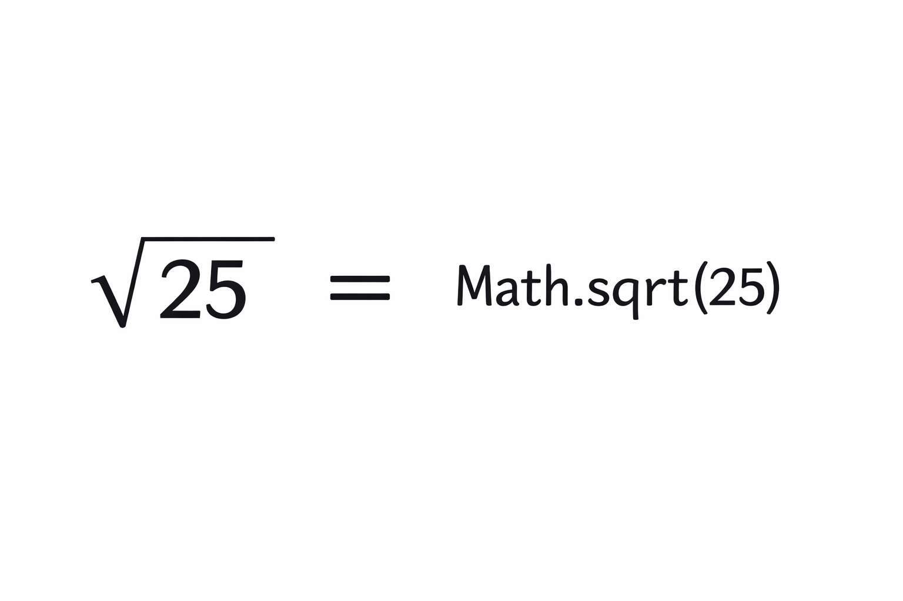
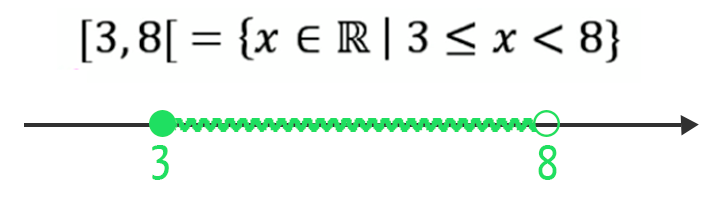
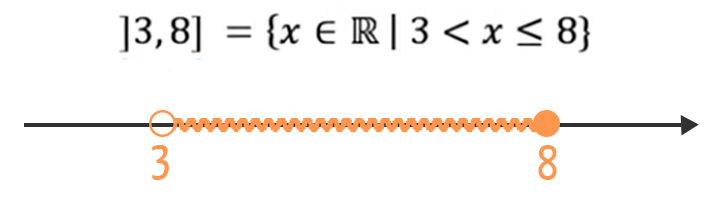

## Índice / Checklist

- [x] [13/03/2026 - Terminologia - apresentação da disciplina](#13032026)
- [x] [16/03/2026 - Primeiro exemplo de programa](#16032026)
- [x] [23/03/2026 - Funções nativas](#23032026)
- [x] [27/03/2026 - Teste de mesa](#27032026)
- [x] [30/03/2026 - Exercícios](#30032026)
- [x] [03/04/2026 - Feriado - Sexta-feira santa]
- [x] [06/04/2026 - Tipos de dados](#06042026)
- [x] [10/04/2026 - Condicionais](#10042026)
- [x] [13/04/2026 - Condicionais](#13042026)
- [ ] [17/04/2026 - Exercícios](#17042026)
- [ ] [24/04/2026 - Funções](#24042026)
- [ ] [27/04/2026 - Exercícios](#27042026)
- [ ] [04/05/2026 - Exercícios](#04052026)
- [ ] [08/05/2026 - Avaliação 1º Bimestre](#08052026)


# 13/03/2026
[↑ Voltar para o Índice](#índice--checklist)

 - Terminologia - apresentação da disciplina

(melhor dia possível para a primeira aula de algoritmos)

* Terminologia

## ***Precisamos nos comunicar.***

O que é um algoritmo?

Dinâmica do robô linguagem com comandos (levante / sente)

- Linguagem que será usada para dinâmica frente (um passo a frente) direita
  (giro de 90° )

  A sequência de comandos que levam o robô do ponto A ao ponto B é o algoritmo.


# 💻 Guia de Hardware para Iniciantes

Entender como um computador funciona é mais simples do que parece. Podemos
comparar o funcionamento de uma máquina com um **escritório de estudos**.


## 🧠 1. CPU (Processador)
**A Analogia:** É o **Estudante** (A Pessoa). O Processador é o cérebro do
computador. É ele quem lê os dados, faz as contas e executa as ordens que você
dá.
* **Na prática:** Quanto mais rápido o estudante, mais rápido as tarefas são
  resolvidas.

## 📏 2. Memória RAM
**A Analogia:** É a **Mesa de Trabalho**. A RAM é o espaço onde o computador
coloca tudo o que você está usando **agora** (abas do navegador, um jogo ou um
documento).
* **Mesa Grande (Muita RAM):** Você consegue abrir vários livros e abas ao mesmo
  tempo sem lentidão.
* **Mesa Pequena (Pouca RAM):** O computador "engasga" porque precisa ficar
  guardando um livro para conseguir abrir outro.
* **Atenção:** Quando você desliga o computador, a mesa é limpa. Se não salvou,
  os dados da RAM somem.

## 📚 3. Armazenamento Permanente (SSD ou HD)
**A Analogia:** É a **Biblioteca (Estante)**. É aqui que seus arquivos, fotos e
o sistema operacional ficam guardados para sempre.
* **HD (Hard Drive):** Uma biblioteca enorme, mas antiga e lenta para encontrar
  os livros.
* **SSD:** Uma biblioteca moderna e ultra veloz. Ter um SSD faz o computador
  ligar e abrir programas em segundos.


## 📊 4. Unidades de Medida
O computador entende o mundo através de **Bytes**. Cada caractere ocupa 1 Byte.
A regra é simples: para subir de nível, acrescente **3 zeros** (multiplique por
1.000).

| Nome | Sigla | Valor (Aprox.) | Exemplo real |
| :--- | :--- | :--- | :--- |
| **Byte** | B | 1 caractere | Uma letra "A". |
| **Kilobyte** | KB | 1.000 bytes | Um arquivo de texto leve. |
| **Megabyte** | MB | 1.000 KB | Uma música em MP3. |
| **Gigabyte** | GB | 1.000 MB | Um filme em HD. |
| **Terabyte** | TB | 1.000 GB | Milhares de fotos de alta qualidade. |
| **Petabyte** | PB | 1.000 TB | Dados de um servidor de rede social. |
| **Exabyte** | EB | 1.000 PB | Grande parte do tráfego da internet. |
| **Zettabyte** | ZB | 1.000 EB | Quase todos os dados do mundo digital. |
| **Yottabyte** | YB | 1.000 ZB | Uma escala colossal para o futuro. |


## 🎨 5. Placa de Vídeo (GPU)
**A Analogia:** É o **Desenhista Especialista**. Enquanto o estudante (CPU)
cuida da lógica, a Placa de Vídeo foca apenas em gerar imagens e vídeos. É
essencial para jogos e edição de vídeo pesada.

## 📺 6. Tela (Resolução)
A imagem é formada por milhões de pontinhos chamados **Pixels**.
* **Resolução:** É a quantidade desses pontos. Quanto mais pixels (como no
  **4K**), mais nítida é a imagem.

## 📷 7. Câmera e Imagem
A câmera funciona como o olho do dispositivo, transformando a luz em dados
digitais.

Megapixels (MP)

Megapixel (MP): Mede a quantidade de informação visual. 1 Megapixel = 1 milhão
de pontos (pixels) que formam a foto. Quanto mais MP, mais você pode ampliar ou
imprimir a foto em tamanhos grandes sem perder a nitidez.

Resolução: A Nitidez da Imagem A resolução é a medida de quantos pixels existem
na largura e na altura da tela ou da foto.

Densidade: Ter muitos Megapixels em um sensor pequeno nem sempre é bom; o que
importa é a qualidade de cada pixel para captar luz.

### 📺 Resoluções e Pixels
A resolução define a nitidez da imagem através da quantidade de pontos (pixels)
na tela:

* **Full HD:** 1920 x 1080p (Cerca de 2 milhões de pixels ou 2 MP).
* **4K (Ultra HD):** 3840 x 2160p (Cerca de 8 milhões de pixels ou 8 MP).
* **8K (FUHD):** 7680 x 4320p (Cerca de 33 milhões de pixels ou 33 MP).

> **Dica didática:** Quanto maior a resolução, mais potente precisa ser a sua
> **Placa de Vídeo** (o desenhista) e mais rápida a sua **Internet** para
> carregar todos esses pontos sem travar.

## 🔌 8. Placa-Mãe
**A Analogia:** É o **Corpo e as Conexões do escritório**. É a peça principal
que interliga tudo. Nela, o processador se comunica com a memória, que se
comunica com o armazenamento e a placa de vídeo. Sem ela, as peças ficariam
isoladas.


# 16/03/2026
[↑ Voltar para o Índice](#índice--checklist)

Formalização de conceitos sobre algoritmos: entrada, processamento, saída.
Características: estado inicial, limite de resolução, condição e repetição.
 
### Primeiro exemplo de programa - somar dois números
    
## Software

### Sistema Operacional

O objetivo de um sistema operacional é "tornar um sistema computacional"
operacional (usável).

Por exemplo, ao ligar um notebook o windows é carregado e podemos usar o
computador. Em um celular, o Android é o sistema operacional que permite o uso
do aparelho.

Principais sistemas para computadores
 - Linux
 - Windows
 - MacOs

### Aplicativos

 - programas de computador que são executados em um hardware e usando um sistema
   operacional. Exemplo, Google Chrome (navegador para internet). Whatsapp,
   aplicativo de mensagens usado principalmente em dispositivos móveis
   (celulares).

### Linguagem de programação

Uma linguagem de programação é um conjunto de regras e símbolos que permite a um
humano enviar instruções lógicas ao computador. Ela serve como uma ponte de
tradução entre a nossa língua e o código binário interpretado pelo hardware.
Através dela, definimos como o software deve processar dados e reagir a
comandos.

### Algoritmo

Algoritmo é uma sequência finita de instruções lógicas e ordenadas para resolver
um problema ou executar uma tarefa.

### Entrada - Processamento - Saída

Qualquer algoritmo tem entrada, processamento e saída.


### HTML - Hiper Text Markup Language

Possibilita a construção de interfaces gráficas (tela). Define os elementos de
entrada de dados, controles para acionar o processamento e mostra os resultados.

### Javascript

Linguagem de programação que usaremos. Normalmente faz o processamento.

### Variáveis

Local, na memória RAM, onde guardamos algo. Esse algo pode ser um número, um
texto, uma data, um booleano, etc.

### Pseudocódigo 

Código fonte de um algoritmos em linguagem estruturada, próxima do português,
que descreve de forma clara e simplificada os passos de um algoritmo, sem se
preocupar com a sintaxe rígida de uma linguagem de programação real. O
pseudocódigo serve para planejar e comunicar a lógica antes da implementação no
código final.

Exemplo:
``` 
leia(x)
leia(y)
soma = x + y;
escreva(soma)
``` 


### Programa usando HTML e JS (exemplo básico)

```html 

<!DOCTYPE html>
<html lang="pt-br">

<head>
    <meta charset="UTF-8">
    <meta name="viewport" content="width=device-width, initial-scale=1.0">
    <title>Programa soma</title>
</head>

<body>
    <h1>Programa exemplo - somar dois números</h1>
    <!-- Programa em HTML e JavaScript para somar 2 números -->
    <label for="inputN1">X</label>
    <input type="number" name="inputN1" id="inputN1">
    <br>
    <label for="inputN2">Y</label>
    <input type="number" name="inputN2" id="inputN2">
    <br>
    <br>
    <input type="button" value="Somar" onclick="funcaoResponsavelPeloCalculo()">
    <br>
    <label for="resposta">x+y = </label>
    <span id="resposta">innerHTML</span>

    <script>
        function funcaoResponsavelPeloCalculo() {
            let x = parseFloat(document.getElementById("inputN1").value);
            let y = parseFloat(document.getElementById("inputN2").value);
            let s = x + y;
            document.getElementById("resposta").innerHTML = s;
        }
    </script>

</body>

</html>
``` 

[Use o exemplo acima (copie, cole e modifique) para fazer os exercícios da lista](https://github.com/rjhalmeman/algoritmos-2026/blob/main/1-Bimestre/01_listaDeExercicios_Sequenciais.md)

Vídeo mostrando o algoritmo, digo, mostrando como se deve fazer cada exercício.

https://youtu.be/bNYJ1Q-mNB4


# 23/03/2026
[↑ Voltar para o Índice](#índice--checklist)

### 	Estruturação de raciocínio lógico. Estruturas sequenciais. Teste de mesa.

Visual Studio Code - VSCode

O editor de textos que utilizaremos para o desenvolvimento de programas é o
vscode.

[Como instalar o VSCode no windows](https://www.youtube.com/watch?v=XFb97QhzDWg)

Fazendo o procedimento até o minuto 1m20 (um minuto e vinte segundos) do vídeo
já é suficiente.


## Funções pré-definidas (ou funções nativas)

São funções criadas que já estão disponíveis para uso.




As funções pré-definidas (também chamadas de **funções internas** ou
**nativas**) são comandos especiais que já vêm prontos para uso em calculadoras
e programas de computador. Elas realizam cálculos e tarefas que não podem ser
feitas diretamente com os símbolos do teclado.


## 🧮 Principais funções matemáticas

| Função | Comando | Descrição | Exemplo |
|--------|---------|-----------|---------|
| **Raiz quadrada** | `sqrt` | Do inglês *square root* - calcula a raiz quadrada de um número | `sqrt(25)` = 5 |
| **Potência** | `^` ou `**` | Eleva um número a outro | `5^2` = 25 ou `5**2` = 25 |
| **Seno** | `sin` | Calcula o seno de um ângulo (em graus ou radianos) | `sin(30°)` = 0,5 |
| **Cosseno** | `cos` | Calcula o cosseno de um ângulo | `cos(60°)` = 0,5 |
| **Tangente** | `tan` | Calcula a tangente de um ângulo | `tan(45°)` = 1 |
| **Logaritmo** | `log` | Logaritmo na base 10 | `log(100)` = 2 |
| **Logaritmo natural** | `ln` | Logaritmo na base *e* (≈ 2,718) | `ln(7,389)` ≈ 2 |
| **Valor absoluto** | `abs` | Retorna o valor positivo do número | `abs(-10)` = 10 |
| **Arredondamento** | `round` | Arredonda para o inteiro mais próximo | `round(3,7)` = 4 |
| **Alert** | `alert` | Mostra um popup na tela com uma mensagem | `alert("Programa pausado")`|


## ✅ Por que usar funções?

| Benefício | Explicação |
|-----------|------------|
| **⚡ Praticidade** | Não precisamos memorizar fórmulas complexas |
| **🎯 Precisão** | Os cálculos são feitos com alta exatidão |
| **🚀 Velocidade** | Resolvem problemas complexos em segundos |
| **🔄 Consistência** | Sempre retornam o mesmo resultado para a mesma entrada |


## 📝 Exemplo

Faça um programa usando HTML e JS que possibilite que o usuário informe um
número e seja calculada a raíz quadrada desse número.

``` html

<!DOCTYPE html>
<html lang="pt-br">

<head>
    <meta charset="UTF-8">
    <meta name="viewport" content="width=device-width, initial-scale=1.0">
    <title>Cálculo da Raíz Quadrada de um Número</title>
</head>

<body>
    <h1>Programa para calcular a raiz quadrada de um número</h1>
    <!-- contentários no HTML são feitos assim -->

    <!-- Entrada de dados (html) -->
    <label for="inputNumero">Valor do Número</label>
    <input type="number" name="inputNumero" id="inputNumero">
    <br>
    <!-- Processamento de dados (html) -->
    <input type="button" value="Calcular" onclick="calcular()">
    <br>
    <!-- Saída de dados (html) -->
    <label for="resposta">Raiz Quadrada</label>
    <span id="resposta"></span>

    <script>
        function calcular() {
            //entrada de dados (para função)
            let valorNumero = parseFloat(document.getElementById("inputNumero").value);
            //processamento (para função)
            //a função Math.sqrt() é uma função nativa do JavaScript que calcula a raiz quadrada de um número
            let valorRaiz = Math.sqrt(valorNumero);
            //saída de dados (para função)
            document.getElementById("resposta").innerHTML = valorRaiz;
        }
    </script>
</body>

</html>

```


# 27/03/2026
[↑ Voltar para o Índice](#índice--checklist)

## Leitura de algoritmos - Exercícios

Teste de mesa - aula em sala de aulas teórica

[Exercícios propostos](https://github.com/rjhalmeman/algoritmos-2026/tree/main/1-Bimestre/exerc%C3%ADcios/2026-03-27%20-%20testeDeMesa)

# 30/03/2026
[↑ Voltar para o Índice](#índice--checklist)

## Formalização de passos para a resolução de problemas. Estruturas sequenciais. Teste de mesa.

Exercícios

https://github.com/rjhalmeman/algoritmos-2026/tree/main/1-Bimestre/exerc%C3%ADcios/2026-03-30%20-%20exercicios


# 06/04/2026
[↑ Voltar para o Índice](#índice--checklist)

## Variáveis. Tipos de dados. Ambiente de desenvolvimento Exercícios com expressões aritméticas, atribuição e saída simples.

Exercícios com diferentes tipos de dados. Concatenação de strings.


1) Faça um programa usando HTML e JS que possibilite que o usuário informe a
cotação do dólar (quantos reais são necessários para comprar 1 dólar) naquele
dia e o programa converta de reais para dólares ou de dólares para reais. Quando
um valor qualquer em dólares (US$) for informado converter para reais. Quando um
valor em reais for informado converter para dólares.


2) Um pequeno meteoro está viajando pelo espaço e você precisa calcular a
**energia cinética** dele ao entrar na atmosfera da Terra.

A fórmula da energia cinética é:

``` 
E = (m * v²) / 2
``` 

Onde:
- E = energia (Joules)
- m = massa do meteoro (kg)
- v = velocidade (m/s)

### ***Deve-se usar placeholder na entrada de dados e concatenação na saída.***


# 10/04/2026
[↑ Voltar para o Índice](#índice--checklist)

## Condicionais
Aulas em sala de aula teórica - G103

[Material complementar](https://github.com/rjhalmeman/algoritmos-2026/blob/main/MaterialComplementarAlgoritmos.md#2-algoritmos-com-condicionais)

if

Aprovado/Reprovado

Bhaskara

Qual número é maior?


# 13/04/2026
[↑ Voltar para o Índice](#índice--checklist)

Extras
[Ciência da aprendizagem](https://www.youtube.com/shorts/LObe19rCzYQ?feature=share)

[Grifar](https://www.youtube.com/shorts/yXgQ_VJYunk)


Onde "aparece" o que eu coloco no console.log("algo").

[Exemplos](https://github.com/rjhalmeman/algoritmos-2026/tree/main/1-Bimestre/exerc%C3%ADcios/2026-04-13-exemplos)

## Condicionais

[Tutorial de como instalar o nodejs no windows](https://www.youtube.com/watch?v=uIPfbUebAeQ)


Exercícios

1) Faça um programa que leia 3 números inteiros e os coloque em ordem crescente.


2) Faça um programa que leia o valor de x e informe se ele está no intervalo (ou não).
   


3) Faça um programa que leia o valor de x e informe se ele está no intervalo (ou não).
 .

5) Como seria fazer uma programa genérico, para que fosse possível informar os limites e o programa avaliasse se está
   ou não no intervalo?

# 17/04/2026
[↑ Voltar para o Índice](#índice--checklist)

## Variáveis - exercícios

Exercícios juntando os conteúdos já estudados (variáveis, sequenciais,
condicionais)

# 24/04/2026
[↑ Voltar para o Índice](#índice--checklist)

## Funções

Criação de funções em JS. Passagem de parâmetros. Desvio de fluxo de execução

Aulas em sala de aula teórica - G101


# 27/04/2026
[↑ Voltar para o Índice](#índice--checklist)

## Exercícios com funções e condicionais

# 04/05/2026
[↑ Voltar para o Índice](#índice--checklist)

## Exercícios com funções e condicionais

# 08/05/2026
[↑ Voltar para o Índice](#índice--checklist)

Avaliação do 1º Bimestre


