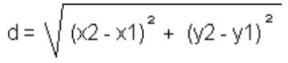
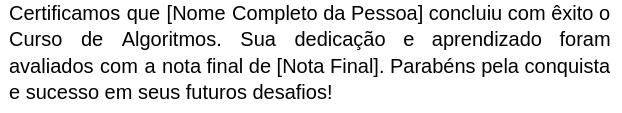
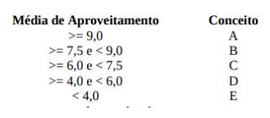
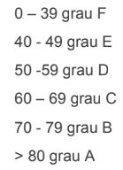

<a id="indice"></a>

# Índice

- [Lista 01 - Sequenciais](#lista-01)
- [Lista 02 - Sequenciais](#lista-02)
- [Lista 03 - Sequenciais](#lista-03)
- [Lista 04 - Sequenciais](#lista-04)
- [Lista 05 - Condicionais](#lista-05)
- [Lista 06 - Condicionais](#lista-06)
- [Lista 07 - Condicionais / Funções](#lista-07)

<p align="center">
  
</p>

<a id="lista-01"></a>

# Lista 01 - Sequenciais

[⬆ Voltar ao Índice](#indice)


---

1) Faça um algoritmo que leia as 4 notas de um aluno e calcule a média aritmética simples deste aluno. 
```js
​        media = (nota1+nota2+nota3+nota4)/4
``` 

2) Faça um programa que leia um número e mostre como resposta esse número elevado ao cubo.
   
3) Faça um algoritmo que calcule a hipotenusa. Usar fórmula de Pitágoras.
      
      ```js
      h = Math.sqrt(b**2+c**2)
      ```

4) Faça um programa de computador para calcular a área de um retângulo. 
   
   ``` js 
   area = base * altura
   ```
   
   

5) Faça um programa que calcule quantas peças de piso são necessárias para um determinado ambiente. Deve-se informar as dimensões do ambiente em metros e o tamanho dos pisos em centímetros. Considere que é necessário um acréscimo de 10% na quantidade de pisos para que haja sobra para recortes.

6) Faça um programa que calcule o preço de um produto à vista e a prazo. Informa-se o preço do produto e o programa calcula e mostra o preço do produto com desconto de 10% e o preço do produto com acréscimo de 5%.

7) A fábrica de refrigerantes Meia-Cola vende seu produto em três formatos: lata de 350 ml, garrafa de 600 ml e garrafa de 2 litros. Se um comerciante compra uma determinada quantidade de cada formato, faça um algoritmo para calcular quantos litros de refrigerante ele comprou.

8) Construa um algoritmo que, tendo como dados de entrada dois pontos quaisquer no plano, P(x1,y1) e P(x2,y2), escreva a distância entre eles. A fórmula que efetua tal cálculo é:

<p align="center">
  
</p>

9) Pedrinho tem um cofrinho com muitas moedas, e deseja saber quantos reais conseguiu poupar. Faça um algoritmo para ler a quantidade de cada tipo de moeda, e imprimir o valor total economizado, em reais. Considere que existam moedas de 1, 5, 10, 25 e 50 centavos, e ainda moedas de 1 real. Não havendo moeda de um tipo, a quantidade respectiva é zero.

10) Um funcionário recebe um salário fixo mais 4% de comissão sobre as vendas. Faça um algoritmo que receba o salário fixo de um funcionário e o valor de suas vendas, calcule e mostre a comissão e o salário final do funcionário.<p align="center">
  
</p>

<a id="lista-02"></a>

# Lista 02 - Sequenciais

[⬆ Voltar ao Índice](#indice)


1) Faça um algoritmo que leia o valor de x e calcule ```f(x)=x² ``` (x ao quadrado).

2) Faça um algoritmo que leia um valor numérico, calcule o dobro desse valor e mostre a resposta.

3) Faça um algoritmo que leia um valor em polegadas e mostre seu equivalente em milímetros. 1 polegada = 2,54 cm.

4) Faça um algoritmo que quando fornecido um valor em reais, calcule e mostre o valor acrescido de 15%.

5) Faça um algoritmo que leia um valor em reais e uma porcentagem, calcule e mostre o valor subtraído da porcentagem.

6) Um funcionário recebe um salário fixo mais 4% de comissão sobre as vendas. Faça um algoritmo que receba o salário fixo de um funcionário e o valor de suas vendas, calcule e mostre a comissão e o salário final do funcionário.

7) Dado um número de apartamento, escreva o andar e o número do apartamento. Por exemplo, 204. Resposta esperada, Andar 2, Apartamento 04.

8) Kelvysmundo está projetando uma piscina retangular para seu quintal. Ele quer calcular quanto volume de água será necessário para encher a piscina até a borda. Escreva um algoritmo que, com base nas medidas de largura, comprimento e profundidade fornecidas em metros, calcule o volume de água necessário em litros
   cúbicos para preencher completamente a piscina. Lembrando que cada metro cúbico equivale a 1000 litros de água. Após calcular o volume necessário, exiba o resultado.

09) Elabore um enunciado de um problema relacionado com seu dia-a-dia, que possa ser resolvido por meio de um algoritmo, e proponha uma solução.

10) Elabore um algoritmo que leia 2 números (maiores que 0), e imprima os números informados, a soma, subtração do primeiro pelo segundo, multiplicação, considerando a seguinte saída: 
    
    <p align="center" >
     
    </p>

11) Elabore um algoritmo que leia um número real e imprima a terça parte desse número.

12) Elabore um algoritmo que leia um número positivo maior que 0, calcule e mostre:
    
    <p align="center">
    
    </p># Lista de exercícios 03 - Sequenciais - testes de mesa


#### Considerando que uma variável é um local (na memória RAM) que guarda alguma coisa.
#### Para todos os exercícios, calcule e mostre o valor que estará na variável ou variáveis da pergunta após realizar os cálculos (processamento). Não é necessário programar, apenas fazer o teste de mesa.

<a id="lista-03"></a>
# Lista 03 - Sequenciais

[⬆ Voltar ao Índice](#indice)

1) Qual o valor de soma? (exemplo do que deve ser feito para cada um dos exercícios)

   ```js
   let x=3;
   let y=4;
   let soma = x + y;
   console.log("O resultado da soma é " + soma);
   ```
      Neste caso, para resolver pode ser feito assim:
      #### 
   soma = 3 + 4  // soma recebe 3 + 4. Ou seja, a variável (um local na RAM) chamado ***soma*** vai receber e guardar o resultado da conta que é 7. O console.log, vai literalmente escrever na tela o que está entre aspas (**"O resultado da soma é "**) e na sequência colocar o conteúdo da variável ***soma***. O resultado da soma é 7 //mostra o valor contido em ***soma***, que é 7.


2. Qual o valor de z?

```js
   let x=5;
   let y=2;
   let z = x**2-5+y;
   console.log("Na variável z tem o valor " + z);
```

3. Qual o valor de k?

   ```js
   let x=3;
   let y=4+x;
   let k = x**3*y+7;
   console.log("O valor de k é "+k);
   ```
4. Qual o valor de x?

   ```js
   
   let a=6;
   let b=4-a;
   let x = (a**3*b+7)/2;    
   console.log("O valor de x é " + x)
   
   ```
5. Qual o valor de s?

   ```js
   function soma(a,b){
       let soma = a+b;
       return soma;
   }
   let s = soma(6,7);
   console.log("O valor de s é " + s)
   ```
6. Qual o valor de x?

   ```js
   function pitagoras(b,c){
    return Math.sqrt(b**2+c**2)
   }
   let h = pitagoras(3,4);
    console.log("O valor da hipotenusa é "+ h)
   ```
7. Quais os valores das médias?

   ```js
   function media(n1,n2,n3,n4){
      return (n1+n2+n3+n4)/4;
   }
   
   let m1 = media(8,8,8,8);
   let m2 = media(5,6,7,8);
   let m3 = media(4,4,4,4);
   let m4 = media(10,9,10,9);
   let n1=7;
   let n2=10;
   let n3=n1+2;
   let n4=90/100*n2;
   let m5 = media(n1,n2,n3,n4);
   console.log("Média 1 = " + m1);
   console.log("Média 2 = " + m2);
   console.log("Média 3 = " + m3);
   console.log("Média 4 = " + m4);
   console.log("Média 5 = " + m5);
   ```
8. Quais os valores de x1 e x2?

   ```js
   let x1=4,  x2=6 , y1=5 , y2=7;
   let distancia = ((x2-x1)**2+(y2-y1)**2)**(1/2);
   console.log("Distância = "+ distancia);
   ```
9. Qual o valor de x?

   ```js
   // ax + b = 0
   let a = 4, b = -8;
   let x = -b / a;
   console.log("Solução da equação");
   console.log( a + "x - " + b + " = 0 ");
   console.log(a+"x="+b*-1)
   console.log("x = " + -b + "/" + a);
   console.log("x = " + x);
   ```

10. Qual a área do triângulo?

      ```js
      let base = 10, altura = 5;
      let area = (base * altura) / 2;
      console.log("Área do triângulo =", area);
      ```

11. Porcentagem com desconto, qual o valor do preço final?

      ```js
      let preco = 150;
      let desconto = 10; // 10%
      let precoFinal = preco * (1 - desconto / 100);
      console.log("6. Preço com 10% de desconto =", precoFinal);
      ```
12. Média ponderada

      ```js
      let n1 = 7, n2 = 9, peso1 = 2, peso2 = 3;
      let mediaPond = (n1*peso1 + n2*peso2) / (peso1 + peso2);
      console.log("Média ponderada = "+ mediaPond);
      ```<p align="center">
  
</p>

<a id="lista-04"></a>

# Lista 04 - Sequenciais

[⬆ Voltar ao Índice](#indice)


1) Escreva um algoritmo que troque os valores de duas variáveis. Por exemplo, se a = 5 e b = 3, após a execução do algoritmo, a deverá conter o valor 3 e b deverá conter o valor 5.

2) Crie um algoritmo que calcule a gorjeta de um restaurante. O usuário deve inserir o valor total da conta e o algoritmo deve calcular e exibir 10% desse valor como gorjeta.

3) Escreva um algoritmo que converta uma temperatura de graus Celsius para Fahrenheit. O usuário deve inserir a temperatura em Celsius e o algoritmo deve exibir o valor equivalente em Fahrenheit.

4) Crie um algoritmo que converta um valor de uma moeda para outra. O usuário deve inserir o valor em uma moeda (por exemplo, em reais) e o algoritmo deve converter para outra moeda (por exemplo, dólares), utilizando uma taxa de conversão fixa.

5) Faça um algoritmo que calcule a área de um retângulo. O usuário deve inserir o comprimento e a largura do retângulo, e o algoritmo deve calcular e exibir a área.

6) Crie um algoritmo que calcule a idade de uma pessoa em dias. O usuário deve inserir sua idade em anos, 
   meses e dias e o algoritmo deve calcular e exibir a idade em dias. Considere que os meses têm 30 dias.

7) Considere como entrada de dados o nome completo de uma pessoa e sua nota final. Faça um programa que imprima o texto do certificado.

<p align="center">
  
</p>

8) Escreva um algoritmo que receba três valores distintos e armazene-os em três variáveis (por exemplo, a, b, e c). O algoritmo deve então realizar uma troca de valores de forma que, ao final da execução, a variável a contenha o valor originalmente armazenado em b, a variável b contenha o valor originalmente armazenado em c, e a variável c contenha o valor originalmente armazenado em a.

9) Faça um programa em JS que posicione um botão na tela e um parágrafo identificado como contador. Cada vez que o usuario clicar o botão o contador será incrementado em 1.

10) Faça um programa em JS que posicione um botão na tela e um parágrafo identificado como acumulador. Deve ter também um input para que o usuário digite números. Cada vez que o usuario clicar o botão o acumulador irá somar ao acumulador o valor que estiver no input. Considere que o valor inicial é zero.<p align="center">
  
</p>

<a id="lista-05"></a>
# Lista 05 - Sequenciais

[⬆ Voltar ao Índice](#indice)


1) Escreva um programa que resolva o seguinte problema: uma cópia “xerox” custa R$ 0,25 por folha, mas acima de 100 folhas esse valor cai para R$ 0,20 por unidade. Dado o total de cópias, informe o valor a ser pago.

2) Escreva um programa que calcule as raízes da equação do 2o grau; os valores de a, b e c são fornecidos pelo usuário. Use a fórmula de Bháskara.

3) Não é possível dividir um número qualquer por 0 (zero). Deste modo, faça um programa de computador que divida um número por outro (dividendo e divisor), informados pelo usuário. Tomando o cuidado de verificar se o divisor não é igual a zero.

4) Encontre o dobro de um número inteiro caso ele seja negativo, seu triplo caso seja positivo. Caso for zero, informe o usuário que é um número neutro ou nulo. 

5) Escreva um algoritmo que verifica se um número é positivo, negativo ou zero.

6) Crie um algoritmo que determine se um número é par ou ímpar.

7) Desenvolva um algoritmo que determine se um ano é bissexto ou não.

8) Faça um algoritmo que receba três números como entrada e informe qual deles é o maior.

9) Escreva um algoritmo que verifique se um triângulo é equilátero, isósceles ou escaleno,
   com base em seus lados. A identificação de cada tipo de triângulo:
   
   <div style="margin-left: 120px;">

Equilátero: Um triângulo é equilátero se todos os seus lados têm o mesmo
comprimento.

Isósceles: Um triângulo é isósceles se possui dois lados com o mesmo comprimento
e um lado diferente.

Escaleno: Um triângulo é escaleno se todos os seus lados têm comprimentos
diferentes.

</div>

10) Escreva um algoritmo que receba a idade de uma pessoa e informe se ela é criança, adolescente, adulta ou idosa. Criança até 12 anos, adolescente até 18 anos, adulta até 60 anos e idosa acima de 60;

11) Crie um algoritmo que determine se um número é divisível por 3 e por 5 ao mesmo tempo.## AL06 - Algoritmos - Lista de exercícios 06 - Condicionais

<a id="lista-06"></a>

# Lista 06 - Sequenciais

[⬆ Voltar ao Índice](#indice)

1) Escreva um algoritmo que leia 3 números inteiros e mostre o menor deles.

2) Escrever um algoritmo que lê um conjunto de 4 valores i, a, b, c, onde i é um valor inteiro e positivo e  a, b, c, são quaisquer valores reais. A seguir:
- Se i=1 escrever os três valores a, b, c em ordem crescente.

- Se i=2 escrever os três valores a, b, c em ordem decrescente.

- Se i=3 escrever os três valores a, b, c de forma que o maior entre a, b,c fique dentre os dois.
3) Ler o nome de dois times e o número de gols marcados na partida. Escrever o nome do vencedor. Caso não haja vencedor deverá ser impressa a palavra EMPATE.

4) Escreva um algoritmo que leia as idades de 2 homens e 2 mulheres (considere que as idades dos homens serão sempre diferentes, bem como as das mulheres). Calcule e escreva a soma das idades do homem mais velho com a mulher mais nova, e o produto das idades do homem mais novo com a mulher mais velha.

5) Escrever um algoritmo que lê o número de identificação, as 4 notas obtidas por um aluno nas 4 verificações e a média dos exercícios que fazem parte da avaliação. Calcular a média de aproveitamento, usando a fórmula: 
   ``` 
   MA = (Nota1 + Nota2 x 2 + Nota3 x 3 + Nota4 x 4+ ME )/11
   ``` 
        A atribuição de conceitos obedece a tabela abaixo:

<p align="center">
  
</p>

* O algoritmo deve escrever o número do aluno, suas notas, a média dos exercícios, a média de aproveitamento, conceito correspondente e a mensagem: APROVADO se o conceito for A,B ou C e REPROVADO se o
  conceito for D ou E.


6) São dados graus para as notas de um exame como se segue:

<p align="center">
  
</p>

Codifique o algoritmo para que imprima o grau de qualquer nota dada, para os alunos que fizeram o exame.

7) Ler 3 valores (considere que não serão informados valores iguais) e escrever a soma dos 2 maiores.

8) Elaborar um algoritmo que lê 3 valores a, b, c e verifica se eles formam ou não um triângulo. Supor que os valores lidos são inteiros e positivos. Caso os valores formem um triângulo, calcular e escrever a área deste triângulo. Se não formam triângulo escrever os valores lidos. (lembre-se que a soma de
   dois lados não pode ser menor que o terceiro).

9) Problemas simples do cotidiano podem representar desafios para o mundo computacional. Faça um algoritmo que, dados três números inteiros representando dia, mês e ano de uma data, imprima qual o dia seguinte.

10) Faça um algoritmo que, dado o valor total em reais e o número de prestações desejadas, calcule o valor de cada prestação. O número mínimo de prestações deve ser 12. Se o número de prestações for maior ou igual a 24, adicione 10% de juros ao valor total, se for maior ou igual a 36, adicione 15% de juros ao valor total.<p align="center">
  
</p>

<a id="lista-07"></a>

# Lista 07 - Condicionais / Funções

[⬆ Voltar ao Índice](#indice)


1) O IMC (Índice de Massa Corporal) é um critério da Organização Mundial de Saúde para dar uma indicação sobre a condição de peso de uma pessoa adulta. A fórmula é:

<p align="center">
  
</p>

- Com o valor do IMC calculado o programa deve informar a condição . Conforme a tabela abaixo

<p align="center">
  
</p>

2) Elabore um algoritmo (e programa com HTML e JS) que calcule o que deve ser pago por um
   produto, considerando o preço normal de etiqueta e a escolha da condição de pagamento.
   Utilize os códigos da tabela a seguir para ler qual a condição de pagamento escolhida e
   efetuar o cálculo adequado.
   Código - Condição de pagamento

<div style="margin-left: 320px;">

1 - À vista em dinheiro ou cheque, recebe 15% de desconto

2 - À vista no cartão de crédito, recebe 10% de desconto

3 - Em duas vezes, preço normal de etiqueta sem juros

4 - Em 3 vezes, preço normal de etiqueta mais juros de 5%

</div>

3) Escreva um algoritmo que leia o RA, as 3 notas obtidas por um aluno nas 3 verificações e
   a média dos exercícios que fazem parte da avaliação, e calcule a média de aproveitamento,
   usando a fórmula:
   
   <div style="margin-left: 320px;">

MA = (nota1 + nota 2 * 2 + nota 3 * 3 + ME)/7

</div>

<div style="margin-left: 40px;">

A atribuição dos conceitos obedece a tabela abaixo. O algoritmo deve escrever o RA do
aluno, suas notas, a média dos exercícios, a média de aproveitamento, o conceito
correspondente e a mensagem 'Aprovado' se o conceito for A, B ou C, e 'Reprovado' se o
conceito for D ou E.
Média de aproveitamento Conceito

</div>

<p align="center">
  
</p>

4) Faça um programa que leia o valor de x. Calcule a raiz cúbica de x e 10 elevado a x. É obrigatório que sejam criadas duas funções para o processamento. 

5) Você viajou para os Estados Unidos e descobriu que lá a unidade de medida de temperatura é diferente da do Brasil. Para não ter que acessar um serviço na internet a todo o momento, nem fazer os cálculos manualmente, faça um algoritmo, e programa em JS, que converte a temperatura informada para a temperatura na outra unidade de medida. Ou seja, se a temperatura for informada em Celsius o algoritmo deve fornecer a temperatura em Fahrenheit, já se a temperatura for fornecida em Fahrenheit, o resultado deve ser em
   graus Celsius. As fórmulas de conversão devem ser pesquisadas na internet.

6)    bissexto e NAO caso contrário. Na entrada o ano deve ser maior que>1582. Mais detalhes aqui:
   https://escolakids.uol.com.br/matematica/calculo-do-ano-bissexto.htm

7) Faça um algoritmo, desenhe a GUI(tela), escreva o pseudocódigo e o programa em JS, que informados o nome, o dia e o mês que a pessoa nasceu. Imprima qual o signo dela no seguinte formato: Berola da Silva, você que nasceu em 25/4 e seu signo do horóscopo é Touro e o planeta regente é Vênus.
   
   


8)  🎮 Inspirado em Brawl Stars

Crie um programa em **HTML + JavaScript** onde o usuário informa o **dano base** de um brawler e escolhe uma opção: **1 - Ataque Crítico** ou **2 - Ataque com Super Bônus**. O programa deve calcular e mostrar o dano final conforme a escolha.

Implemente uma estrutura principal que leia os dados e utilize **2 funções auxiliares**: uma para calcular o **dano crítico** (2 vezes o dano base) e outra para calcular o **dano com bônus** (2 vezes o dano base + 500).

---

9) Faça um programa que leia o valor da encomenda e o valor do frete:

Se o valor da encomenda for maior que R$90.00. O frete é gratis (desconsiderar o frete).
Se o valor da encomenda for maior ou igual a R$50.00 e menor que R$90.00. Calcular valor com 50% do valor do frete.
Se a encomenda custa menos de R$50.00. Valor + valor do frete.

👉 Crie **3 funções auxiliares** para cada cálculo.

---

10) 💪 Fitness - IMC (usando funções) :

1 - Calcular IMC
2 - Classificar IMC  

👉 Separe em **2 funções auxiliares**.

---

11) O programa deve ler 4 notas, a quantidade de aulas. A média a ser considerada para aprovação é maior ou igual a 6.0. A quantidade máxima de faltas é 25% da quantidade de aulas. Calcular média e mostrar situação final (aprovado, reprovado por nota ou reprovado por faltas).

👉 Use funções auxiliares para calcular a média e para a situação final.

---
