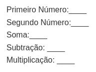
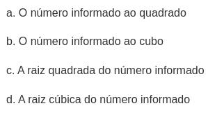

<p align="center">
  
</p>

# Algoritmos - Lista de exercícios 02 - TIII - Sequenciais

1) Faça um algoritmo que leia o valor de x e calcule ```f(x)=x² ``` (x ao quadrado).

2) Faça um algoritmo que leia um valor numérico, calcule o dobro desse valor e mostre a resposta.

3) Faça um algoritmo que leia um valor em polegadas e mostre seu equivalente em milímetros. 1 polegada = 2,54 cm.

4) Faça um algoritmo que quando fornecido um valor em reais, calcule e mostre o valor acrescido de 15%.

5) Faça um algoritmo que leia um valor em reais e uma porcentagem, calcule e mostre o valor subtraído da porcentagem.

6) Um funcionário recebe um salário fixo mais 4% de comissão sobre as vendas. Faça um algoritmo que receba o salário fixo de um funcionário e o valor de suas vendas, calcule e mostre a comissão e o salário final do funcionário.

7) Dado um número de apartamento, escreva o andar e o número do apartamento. Por exemplo, 204. Resposta esperada, Andar 2, Apartamento 04.

8) Kelvysmundo está projetando uma piscina retangular para seu quintal. Ele quer calcular quanto volume de água será necessário para encher a piscina até a borda. Escreva um algoritmo que, com base nas medidas de largura, comprimento e profundidade fornecidas em metros, calcule o volume de água necessário em litros
   cúbicos para preencher completamente a piscina. Lembrando que cada metro cúbico equivale a 1000 litros de água. Após calcular o volume necessário, exiba o resultado.

09) Elabore um enunciado de um problema relacionado com seu dia-a-dia, que possa ser resolvido por meio de um algoritmo, e proponha uma solução.

10) Elabore um algoritmo que leia 2 números (maiores que 0), e imprima os números informados, a soma, subtração do primeiro pelo segundo, multiplicação, considerando a seguinte saída: 
    
    <p align="center" >
     
    </p>

11) Elabore um algoritmo que leia um número real e imprima a terça parte desse número.

12) Elabore um algoritmo que leia um número positivo maior que 0, calcule e mostre:
    
    <p align="center">
    
    </p>