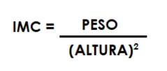
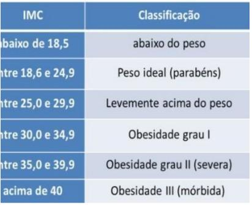
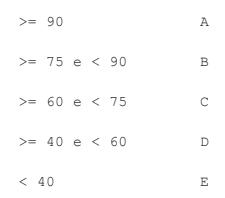
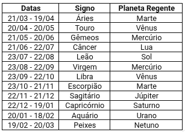

  

# AL06 - Lista de algoritmos 06 - Condicionais

1) O IMC (Índice de Massa Corporal) é um critério da Organização Mundial de Saúde para dar uma indicação sobre a condição de peso de uma pessoa adulta. A fórmula é:

  

- Com o valor do IMC calculado o programa deve informar a condição . Conforme a tabela abaixo

  

2) Elabore um algoritmo (e programa com HTML e JS) que calcule o que deve ser pago por um
   produto, considerando o preço normal de etiqueta e a escolha da condição de pagamento.
   Utilize os códigos da tabela a seguir para ler qual a condição de pagamento escolhida e
   efetuar o cálculo adequado.
   Código - Condição de pagamento

1 - À vista em dinheiro ou cheque, recebe 15% de desconto

2 - À vista no cartão de crédito, recebe 10% de desconto

3 - Em duas vezes, preço normal de etiqueta sem juros

4 - Em 3 vezes, preço normal de etiqueta mais juros de 5%

3) Escreva um algoritmo que leia o RA, as 3 notas obtidas por um aluno nas 3 verificações e
   a média dos exercícios que fazem parte da avaliação, e calcule a média de aproveitamento,
   usando a fórmula:
   
   

MA = (nota1 + nota 2 * 2 + nota 3 * 3 + ME)/7

A atribuição dos conceitos obedece a tabela abaixo. O algoritmo deve escrever o RA do
aluno, suas notas, a média dos exercícios, a média de aproveitamento, o conceito
correspondente e a mensagem 'Aprovado' se o conceito for A, B ou C, e 'Reprovado' se o
conceito for D ou E.
Média de aproveitamento Conceito

  

4) Faça um programa que leia o valor de x. Calcule a raiz cúbica de x e 10 elevado a x. É obrigatório que sejam criadas duas funções para o processamento. 

5) Você viajou para os Estados Unidos e descobriu que lá a unidade de medida de temperatura é diferente da do Brasil. Para não ter que acessar um serviço na internet a todo o momento, nem fazer os cálculos manualmente, faça um algoritmo, e programa em JS, que converte a temperatura informada para a temperatura na outra unidade de medida. Ou seja, se a temperatura for informada em Celsius o algoritmo deve fornecer a temperatura em Fahrenheit, já se a temperatura for fornecida em Fahrenheit, o resultado deve ser em
   graus Celsius. As fórmulas de conversão devem ser pesquisadas na internet.

6)    bissexto e NAO caso contrário. Na entrada o ano deve ser maior que>1582. Mais detalhes aqui:
   https://escolakids.uol.com.br/matematica/calculo-do-ano-bissexto.htm

7) Faça um algoritmo, desenhe a GUI(tela), escreva o pseudocódigo e o programa em JS, que informados o nome, o dia e o mês que a pessoa nasceu. Imprima qual o signo dela no seguinte formato: Berola da Silva, você que nasceu em 25/4 e seu signo do horóscopo é Touro e o planeta regente é Vênus.
   
   

8)  🎮 Inspirado em Brawl Stars

Crie um programa em **HTML + JavaScript** onde o usuário informa o **dano base** de um brawler e escolhe uma opção: **1 - Ataque Crítico** ou **2 - Ataque com Super Bônus**. O programa deve calcular e mostrar o dano final conforme a escolha.

Implemente uma estrutura principal que leia os dados e utilize **2 funções auxiliares**: uma para calcular o **dano crítico** (2 vezes o dano base) e outra para calcular o **dano com bônus** (2 vezes o dano base + 500).

---

9) Faça um programa que leia o valor da encomenda e o valor do frete:

Se o valor da encomenda for maior que R$90.00. O frete é gratis (desconsiderar o frete).
Se o valor da encomenda for maior ou igual a R$50.00 e menor que R$90.00. Calcular valor com 50% do valor do frete.
Se a encomenda custa menos de R$50.00. Valor + valor do frete.

👉 Crie **3 funções auxiliares** para cada cálculo.

---

10) 💪 Fitness - IMC (usando funções) :

1 - Calcular IMC
2 - Classificar IMC  

👉 Separe em **2 funções auxiliares**.

---

11) O programa deve ler 4 notas, a quantidade de aulas. A média a ser considerada para aprovação é maior ou igual a 6.0. A quantidade máxima de faltas é 25% da quantidade de aulas. Calcular média e mostrar situação final (aprovado, reprovado por nota ou reprovado por faltas).

👉 Use funções auxiliares para calcular a média e para a situação final.

---
