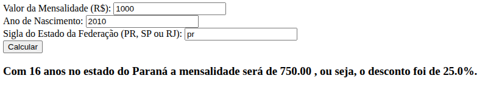
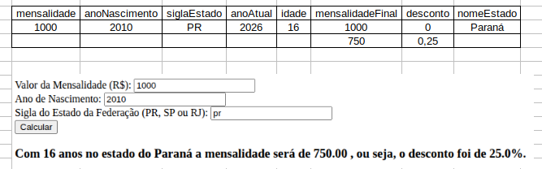
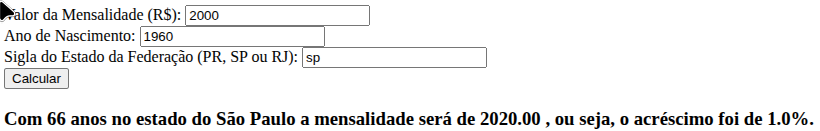

3.1



3.2
Entrada: é o parâmetro sigla (para a função é uma variável)
Processamento e saída
Ao executar, o if compara a sigla com PR, com SP e com RJ. Se um deles for verdadeiro, retorna  o nome do estado (que é a saída).

3.3
```JavaScript
if (siglaEstado != "PR" && siglaEstado != "SP" && siglaEstado != "RJ") {
    alert("Estado inválido! Por favor, insira PR, SP ou RJ.");
    return;
} 
```

Este bloco consiste em uma validação de consistência de dados. O operador lógico && (E) garante que, se a sigla digitada pelo usuário for simultaneamente diferente de "PR", diferente de "SP" e diferente de "RJ", a condição será verdadeira.

Caso o usuário digite um estado não mapeado, o programa dispara um alerta visual (alert) notificando o erro e interrompe imediatamente a execução da função utilizando o return, impedindo que o restante do código processe cálculos com dados inválidos.


3.4 Teste de Mesa 1
Entradas: Mensalidade = 1000 | Ano de Nascimento = 2010 | Estado = PRIdade calculada (em 2026): $2026 - 2010 = 16$ anos.

Regra aplicada: Idade menor que 18 anos (idade < 18). O desconto inicial é de 25% (0.25).Cálculo financeiro: $1000 - (1000 \times 0.25) = 750$.

Saída impressa na tela:Com 16 anos no estado do Paraná a mensalidade será de 750.00 , ou seja, o desconto foi de 25.0%.





3.5 Teste de Mesa 2

Entradas: Mensalidade = 2000 | Ano de Nascimento = 1960 | Estado = SPIdade calculada (em 2026): $2026 - 1960 = 66$ anos.

Regra aplicada: Cai no bloco final (else), pois a idade é maior que 60 anos. Como o estado é "SP", o desconto recebe o valor de -1% (-0.01).
Inversão de sinal: Como o desconto é negativo, o código altera a variável operacao para "acréscimo" e converte o desconto para positivo (0.01) 
para fins de exibição.Cálculo financeiro: $2000 - (2000 \times -0.01) = 2000 + 20 = 2020$.

Saída impressa na tela:Com 66 anos no estado do 
São Paulo a mensalidade será de 2020.00 , ou seja, o acréscimo foi de 1.0%.


