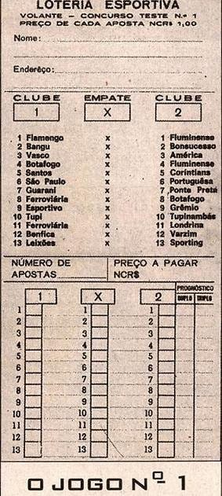

# Lista de Exercícios: Manipulação de Vetores com HTML e JavaScript

---

1. Contagem de Números Pares. Escreva um script em **JavaScript** integrado a uma página **HTML** que leia um **vetor (array)** de no máximo 20 elementos inteiros inseridos pelo usuário. O programa deve exibir o vetor completo na tela e, em seguida, calcular e mostrar a quantidade de **valores pares** que existem guardados nele. Os valores devem ser adicionados ao vetor "um por vez". 

2. Multiplicação de Vetores por Índice. Desenvolva uma página (HTML) que capture dados para dois **vetores** de 10 posições cada. O programa deve realizar a **multiplicação dos elementos de mesmo índice** e armazenar o resultado em um terceiro vetor. Ao final do processamento, mostre o **vetor resultante** na tela de forma organizada.

3. Vetores com Limite de Armazenamento (Buffer de Dados). Elabore um algoritmo que processe um conjunto de 20 valores numéricos fornecidos pelo usuário (no máximo 10 valores em cada vetor). À medida que cada valor for lido, o sistema deve distribuí-lo em dois **vetores auxiliares**: um dedicado a **valores pares** e outro a **valores ímpares**. Ao término da leitura dos  valores, escreva na tela o conteúdo de ambos os vetores. Ao todo, são 20 elementos lidos, mesmo que os vetores resultantes fiquem com tamanhos diferentes.

4. Inversão de Vetor. Escreva um programa que receba um conjunto de 20 valores inteiros (até 20 no máximo) e os exiba na **ordem inversa** à que foi digitada pelo usuário. Para exercitar a lógica de manipulação, crie duas versões desse mecanismo na mesma página:
* **Botão WHILE:** Usar **laço de repetição while**.
* **Botão FOR:** Usar **laço de repetição for**.

5. Separação por Posições do Vetor. Construa uma aplicação que leia um **vetor** de 10 números inteiros e os exiba na tela imediatamente. Logo após, o JavaScript deve gerar dois novos vetores derivados deste vetor principal:
* O primeiro vetor conterá apenas os elementos que estavam nas **posições (índices) ímpares** do vetor original.
* O segundo vetor conterá apenas os elementos que estavam nas **posições (índices) pares** do vetor original.
Imprima os dois novos vetores gerados no final da página.

6. Modificação de Vetor pelo Menor Elemento. Desenvolva um algoritmo que leia um **vetor** composto por até 10 elementos inteiros. O script deve varrer a estrutura para identificar o **menor elemento** contido nele, bem como a sua respectiva **posição (índice)**, exibindo esses dados na interface. Na sequência, crie um novo vetor cujo conteúdo será o resultado da divisão de cada um de seus elementos do vetor original pelo menor valor encontrado. Exiba o **vetor resultante** na tela após a conclusão dos cálculos.

7. Algoritmo de Ordenação Crescente - Escreva uma página que receba um **vetor** de N posições preenchido pelo usuário. Implemente uma lógica de ordenação (com o método *Bubble Sort* evitando usar métodos automáticos como o `.sort()`) para organizar os elementos deste vetor em **ordem crescente**. Apresente o vetor perfeitamente ordenado na tela.

8. Geração e Armazenamento de Números Primos. Escreva um script que identifique de forma automática os 10 primeiros **números primos** que sejam maiores que 100. À medida que forem encontrados, armazene-os sequencialmente em um **vetor X de 10 posições**. Este exercício não necessita de entrada de dados do usuário; o script deve apenas computar os valores e, ao final, mostrar o vetor X completo na tela.

9. Fusão e Ordenação de Vetores. Desenvolva um programa que leia dois **vetores** distintos de tamanho 10 e os exiba na página HTML. Logo após, crie um terceiro vetor de **20 posições** que seja o resultado da união dos elementos dos outros dois vetores. O programa deve ordenar os elementos deste novo vetor em **ordem crescente** antes de exibi-lo na tela. Usar função bubble sort.

10. Filtragem de Elementos Primos. Crie um algoritmo que leia um **vetor K** de até 15 elementos inteiros e faça a impressão dele na tela. Em seguida, o código deve analisar cada número do vetor K, identificar quais deles atendem aos critérios de **números primos** e copiá-los para um novo **vetor P**. Ao final, exiba o vetor P na tela (caso nenhum número seja primo, informe que o vetor ficou vazio).

11. Compactação de Estrutura de Dados. Faça um algoritmo que preencha um **vetor A de 100 posições** (Dica: para não cansar o usuário digitando 100 números, utilize uma função que gere valores inteiros aleatórios positivos e negativos automaticamente). Em seguida, o script deve realizar uma **compactação do vetor**, criando um **vetor B** que conterá apenas os números de A, mas descartando completamente os valores nulos (zeros) e os números negativos. Imprima o vetor B resultante na tela.

    Dica: 
    ```js 
        // Gera números aleatórios entre -50 e 50
        let numero = Math.floor(Math.random() * 101) - 50;
    ``` 

12. Validador de Cartões da Loteria Esportiva. Crie um algoritmo que possua um **vetor gabarito** fixo de 13 elementos inteiros predefinidos, representando os resultados de um teste da loteria esportiva. Os valores permitidos para este gabarito são: `1` (coluna 1), `2` (coluna 2) e `3` (coluna do meio). Em seguida, monte uma interface que permita ler os dados de um apostador: o **nome do jogador** e **endereço do jogador** contendo 13 posições. O script deve comparar o gabarito com as respostas fornecidas, calcular o **número total de acertos** e imprimir na página o nome do apostador, seu endereço e sua pontuação. Se o apostador cravar 13 acertos, exiba em destaque (h1) a mensagem **"Ganhador"**.


   