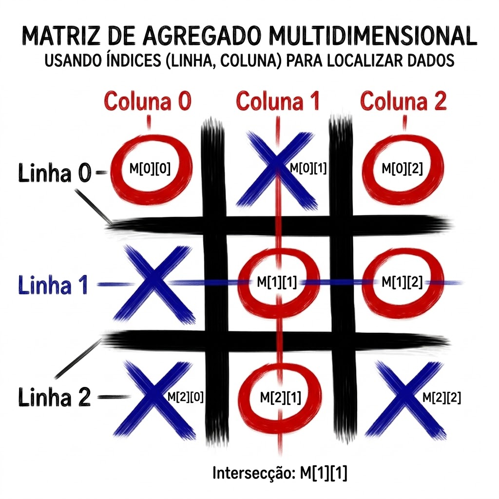

# Algoritmos e Matrizes

# Resumo dos conteúdos estudados anteriormente

Ao longo da disciplina aprendemos a construir algoritmos para resolver problemas de forma organizada e lógica.

Começamos estudando as **variáveis**, que funcionam como "caixas" onde armazenamos informações.

- **Numéricas:** armazenam números inteiros ou reais.
- **Strings:** armazenam textos.
- **Vetores (arrays unidimensionais):** armazenam vários valores do mesmo tipo utilizando um único nome e um índice. (2 bimestre)

Depois estudamos os **algoritmos sequenciais**, onde cada instrução é executada exatamente na ordem em que foi escrita.

Em seguida conhecemos as **estruturas condicionais**, que permitem ao programa tomar decisões utilizando condições (`if`, `else`, `switch`).

Também aprendemos as **estruturas de repetição**, utilizadas quando uma tarefa precisa ser executada várias vezes (`for`, `while` e `do...while`).

Esses quatro conceitos formam a base da programação e aparecem em praticamente todos os programas desenvolvidos atualmente.

---

# Terceiro bimestre

# Agregados Homogêneos Multidimensionais (Matrizes)

## O que é uma matriz?

Uma **matriz** é um **array com duas ou mais dimensões**.

Um exemplo bem conhecido...


Enquanto um vetor possui apenas uma sequência de posições, a matriz organiza os dados em **linhas e colunas**, semelhante a uma tabela.

Na matriz, temos índices nas linhas e colunas



Podemos imaginar uma matriz como:

- uma planilha do Excel;
- uma tabela de notas;
- um calendário;
- um mapa;
- um tabuleiro de jogo.

Sua principal vantagem é organizar informações relacionadas de maneira simples e eficiente.

---

# Analogia

Imagine um prédio.

Um **vetor** representa apenas os apartamentos de um único andar.

```
101 102 103 104
```

Uma **matriz** representa vários andares.

```
1º andar  101 102 103
2º andar  201 202 203
3º andar  301 302 303
```

Cada apartamento pode ser localizado por:

- andar (linha)
- apartamento (coluna)

É exatamente assim que funciona uma matriz.

---

# Primeiro exemplo: Jogo da Velha

O jogo da velha é um dos exemplos mais clássicos de matriz.

```
X | O | X
---------
O | X |
---------
  | O | X
```

Cada posição pode ser acessada utilizando:

```
tabuleiro[linha][coluna]
```

Exemplo:

```
tabuleiro[0][0] = "X"
tabuleiro[1][2] = "O"
tabuleiro[2][1] = "X"
```

Representação em JavaScript:

```javascript
let tabuleiro = [
    ["X", "O", "X"],
    ["O", "X", ""],
    ["", "O", "X"]
];
```

Observe que agora existem **dois índices**:

```
tabuleiro[linha][coluna]
```

---

# Segundo exemplo: Matriz numérica

Uma matriz também pode armazenar números.

```javascript
let matriz = [
    [1,2,3],
    [4,5,6],
    [7,8,9]
];
```

Visualmente:

```
1 2 3
4 5 6
7 8 9
```

Cada número possui uma posição definida pela linha e pela coluna.

---

# Função para somar todos os elementos da matriz

```javascript
function somarMatriz(matriz){

    let soma = 0;

    for(let i = 0; i < matriz.length; i++){

        for(let j = 0; j < matriz[i].length; j++){

            soma += matriz[i][j];

        }

    }

    return soma;

}

let numeros = [
    [1,2,3],
    [4,5,6],
    [7,8,9]
];

console.log(somarMatriz(numeros));
```

Resultado:

```
45
```

---

# Como percorrer uma matriz

Como existem **linhas** e **colunas**, normalmente utilizamos **dois laços de repetição**.

```javascript
for(let linha = 0; linha < matriz.length; linha++){

    for(let coluna = 0; coluna < matriz[linha].length; coluna++){

        console.log(matriz[linha][coluna]);

    }

}
```

O primeiro `for` percorre as linhas.

O segundo percorre as colunas.

---

# Onde encontramos matrizes no dia a dia?

As matrizes aparecem em inúmeras situações.

- Planilhas eletrônicas.
- Calendários.
- Tabelas de preços.
- Mapa de assentos de um cinema.
- Tabuleiro de xadrez.
- Sudoku.
- Jogo da velha.
- Imagens digitais (pixels).
- Mapas em jogos.
- Controle de estoque.
- Horários escolares.

Sempre que os dados estiverem organizados em **linhas e colunas**, uma matriz é uma excelente solução.

---

# Importância das matrizes na Computação

As matrizes estão presentes em praticamente todas as áreas da computação.

São utilizadas em:

- desenvolvimento de jogos;
- processamento de imagens;
- inteligência artificial;
- visão computacional;
- computação gráfica;
- bancos de dados;
- engenharia;
- simulações matemáticas;
- planilhas eletrônicas;
- sistemas científicos.

Saber trabalhar com matrizes é um dos conhecimentos mais importantes para qualquer programador.

---

# Conceitos importantes

Uma matriz possui:

- **Linhas**
- **Colunas**
- **Índices**
- **Elementos**

Exemplo:

```
      Colunas

      0   1   2

0     5   8   4

1     1   7   2

2     9   3   6

Linhas
```

Para acessar o número **7** fazemos:

```javascript
matriz[1][1]
```

---

# Agregados Heterogêneos

Até agora estudamos os **agregados homogêneos**, onde todos os elementos possuem o mesmo tipo.

Exemplo:

```javascript
let notas = [8,7,10,9];
```

Todos são números.

Já os **agregados heterogêneos** armazenam informações de tipos diferentes.

Exemplo:

```javascript
let aluno = {
    nome: "Maria",
    idade: 17,
    aprovado: true
};
```

Observe que agora existem:

- texto;
- número;
- valor lógico.

Esses agregados recebem nomes diferentes dependendo da linguagem, como **objetos**, **registros** ou **structs**, e são muito utilizados para representar pessoas, produtos, veículos, clientes e qualquer entidade do mundo real.

Também podem existir **estruturas heterogêneas multidimensionais**, como um vetor de objetos ou uma matriz contendo registros.

---

# Resumo Geral

**Variáveis** armazenam informações.

**Vetores** armazenam vários elementos do mesmo tipo em uma única dimensão.

**Matrizes** armazenam elementos organizados em linhas e colunas.

**Estruturas condicionais** permitem tomar decisões.

**Estruturas de repetição** permitem executar tarefas repetidamente.

**Objetos (agregados heterogêneos)** armazenam diferentes tipos de informações sobre uma mesma entidade.

Esses conceitos constituem a base para praticamente toda a programação moderna.

---

# Exercícios

## Exercício 1

Leia uma matriz de ordem **3 x 4** (3 linhas e 4 colunas).

Faça funções que calculem:

a) A soma dos elementos de cada coluna.

b) A média dos elementos de cada linha.

c) A soma de todos os elementos da matriz.

---

## Exercício 2

Leia uma matriz 5x5.

Mostre:

- a maior informação da matriz;
- a menor informação da matriz.

---

## Exercício 3

Leia uma matriz 4x4.

Conte quantos números são pares.

---

## Exercício 4

Leia uma matriz 3x3.

Mostre apenas os elementos da diagonal principal.

---

## Exercício 5

Leia uma matriz 3x3.

Calcule a soma da diagonal principal.

---

## Exercício 6

Leia uma matriz 4x4.

Mostre somente os números maiores que 50.

---

## Exercício 7

Leia uma matriz 5x5.

Conte quantos números são positivos.

---

## Exercício 8

Leia uma matriz 3x3.

Crie outra matriz contendo o dobro de cada elemento.

---

## Exercício 9

Construa um programa que represente um **tabuleiro de jogo da velha** utilizando uma matriz.

Permita que o usuário visualize o tabuleiro.

---

## Exercício 10

Crie uma matriz representando uma sala de cinema com **5 linhas** e **8 colunas**.

Considere:

- `0` → assento livre.
- `1` → assento ocupado.

Mostre a quantidade de assentos livres e ocupados.